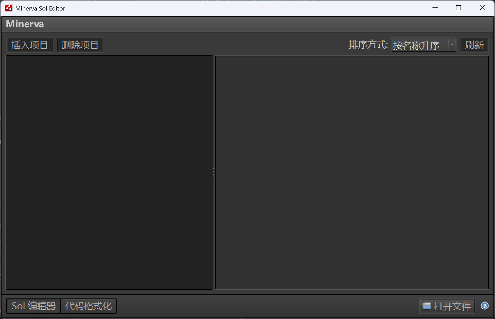
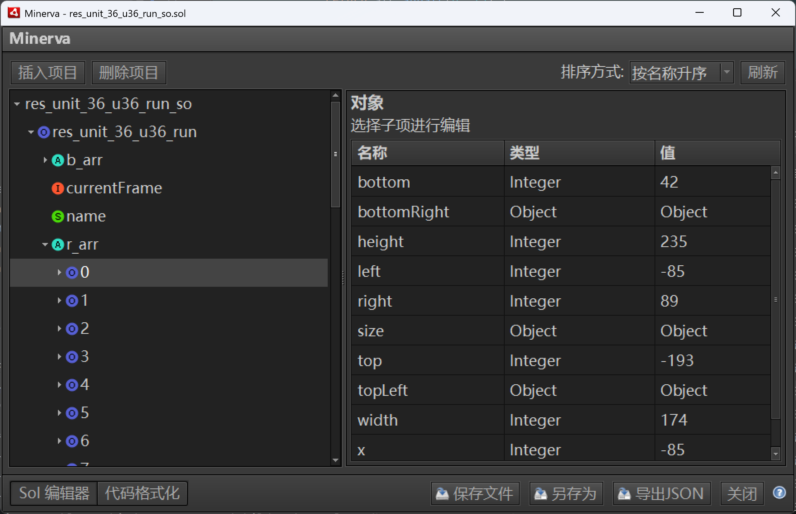
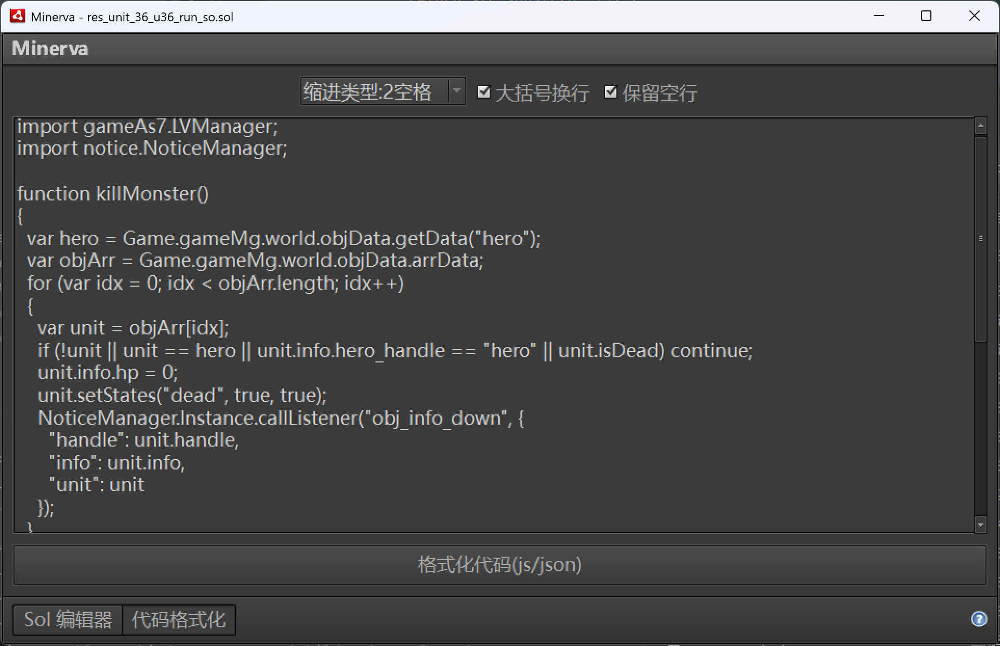

This repo is forked from [.minerva](https://github.com/gmariani/minerva-air)

Minerva is a Flash Local Shared Object editor built based on the AMF3 specification and the AMF0 specification. .minerva is capable of reading and writing all known data types successfully. The Adobe AIR version was replaced in v4 with a [web app](https://github.com/gmariani/minerva). Alse see web app Preview  [here](https://mariani.life/projects/minerva/).

## Features
- Read/Write AS3 Shared Objects - Capable of reading/writing Flash 9 and newer .sol files.
- Read/Write AS2 Shared Objects - Capable of reading/writing Flash 8 and older .sol files.
- JSON Import/Export

## Installation
- Download air file to install on cross-platform systems.
- Download exe file to install on Windows systems.
- Download zip file to use portable version.
- Download the latest release from [here](https://github.com/deuysek/minerva/releases). 

**Note**: To install air file and or run an exe file, you need to have [Adobe AIR](https://airsdk.harman.com/runtime) installed.

## What' s new
- Update project to flex 4.6.
- Add bitmap preview for byteArray.
- Add multiple language support.
- Add multiple edit methods for byteArray including hex, base64, string, utf8, utf16, utf32, etc.
- Add complete preview for each type including Object, Array .etc.
- Add new interface when add an item.

## Screenshots

*Default UI* 

*About Window* 

*Editing AMF/SOL*

*Formatting JSON/js/as3*

*Bitmap Preview*

 

Project Introduction written in Chinese is [here](https://github.com/deuysek/minerva/blob/main/README_zh.md)