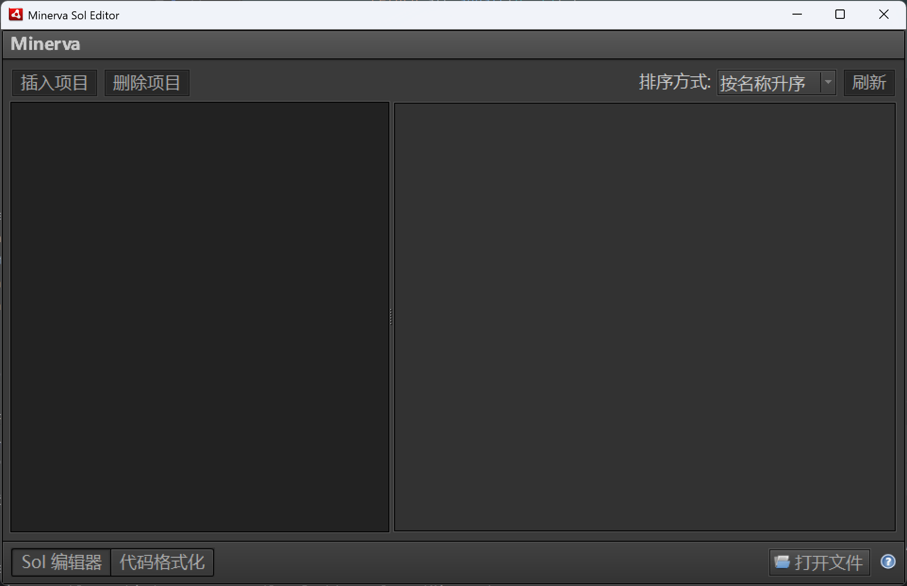
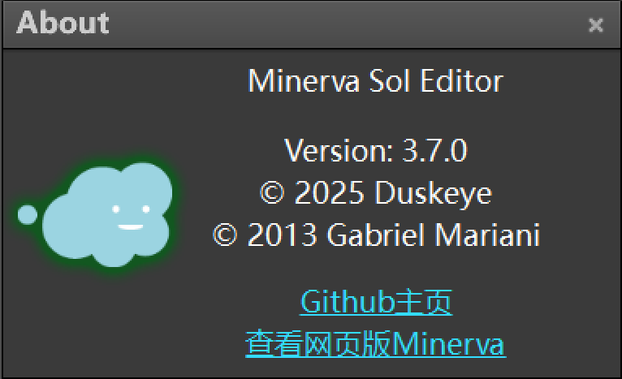
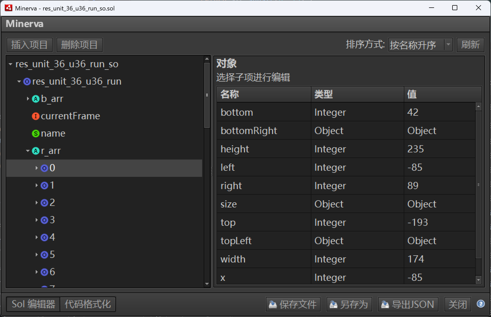
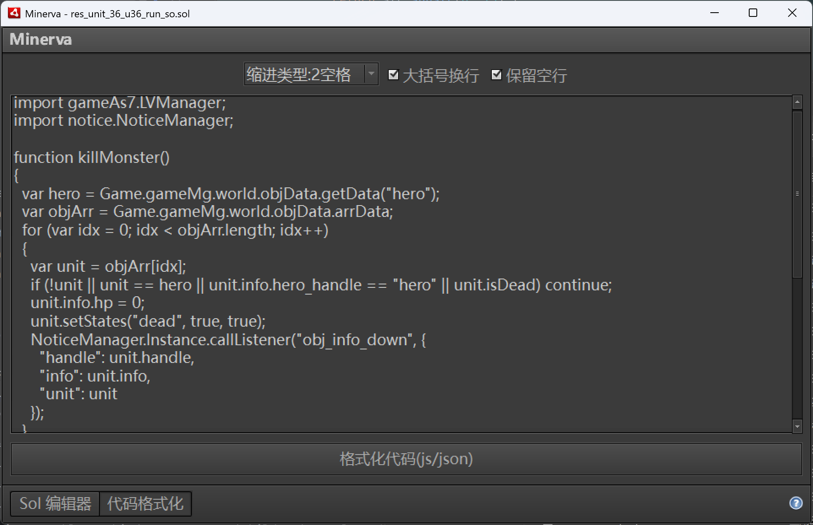
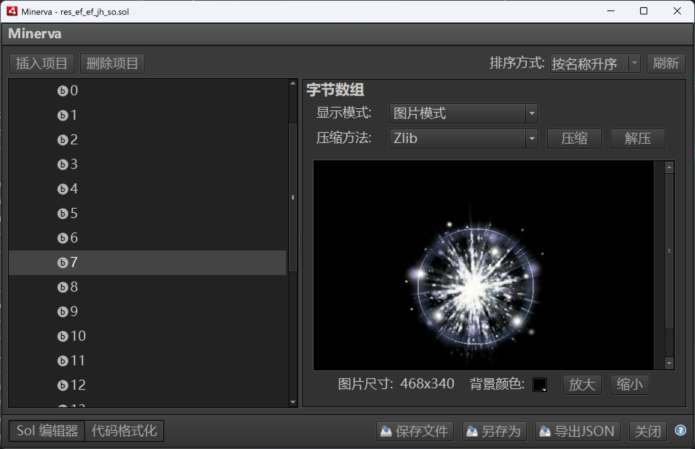

该仓库是从 [.minerva](https://github.com/gmariani/minerva-air) 分叉而来。

Minerva 是一款基于 AMF3 和 AMF0 规范开发的 Flash 本地共享对象编辑器。.minerva 能够成功读写所有已知的数据类型。其 Adobe AIR 版本在 v4 中被替换为[网页应用](https://github.com/gmariani/minerva)，网页应用预览可参见[此处](https://mariani.life/projects/minerva/)。

## 功能特性
- **读写 AS3 共享对象** —— 支持读写 Flash 9 及以上版本的 .sol 文件。
- **读写 AS2 共享对象** —— 支持读写 Flash 8 及更早版本的 .sol 文件。
- **JSON 导入/导出**

## 安装指南
- 下载 air 文件以在跨平台系统上安装。
- 下载 exe 文件以在 Windows 系统上安装。
- 下载 zip 文件以使用便携版。
- 从[此处](https://github.com/deuysek/minerva/releases)下载最新版本。

**注意**：安装 air 文件或运行 exe 文件需预先安装 [Adobe AIR](https://airsdk.harman.com/runtime)。

## 分支新功能
- 项目升级到flex 4.6.
- 添加了ByteArray类型的位图预览功能
- 添加了多语言支持
- 给二进制数据增加了多种编辑模式，如16进制、base64、不同编码的字符串等等
- 各个类型的预览界面完善
- 新增增加项目界面

## 界面截图

*默认界面*  

*关于窗口*  

*编辑 AMF/SOL*  

*格式化 JSON/js/as3*  

*位图预览*  

项目英文介绍详见[此处](https://github.com/deuysek/minerva/blob/main/README.md)